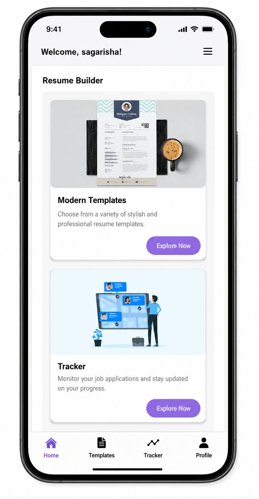
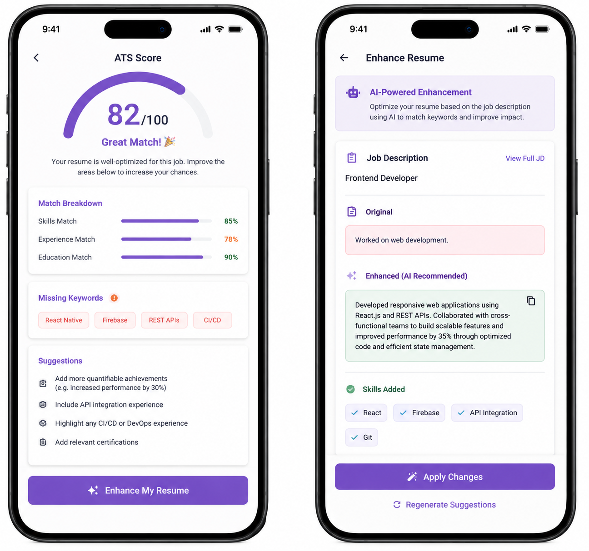

<div align="center">


# Vergo

A React Native application for resume building, ATS analysis, AI-powered resume enhancement, and job application tracking.

<br/>


</div>

---

## About Vergo

Vergo is a mobile application built using React Native that helps users create professional resumes, analyze ATS compatibility, improve resume content using AI, and track job applications in one place.

The application provides multiple resume templates, PDF export functionality, ATS scoring based on job descriptions, AI-powered content enhancement using the Groq API, and a job application tracker integrated with Google Maps.

---

## Features

* User Authentication (Sign Up, Login, Password Reset)
* Resume Builder with Multiple Templates
* PDF Resume Generation
* ATS Score Analysis
* AI Resume Enhancement using Groq API
* Job Description Matching
* Job Application Tracker
* Google Maps Integration
* User Profile Management

---

## Screenshots

### Authentication

<p align="center">
  
</p>

### Dashboard

<p align="center">
  
</p>

### Resume Templates & Editor

<p align="center">
  
</p>

### PDF Preview

<p align="center">
  
</p>

### ATS Analysis & AI Enhancement

<p align="center">
  
</p>

### Job Application Tracker

<p align="center">
  
</p>

---

## Tech Stack

| Layer          | Technology              |
| -------------- | ----------------------- |
| Framework      | React Native (Expo)     |
| Authentication | Firebase Authentication |
| Database       | Firebase Firestore      |
| Storage        | Firebase Storage        |
| AI Integration | Groq API                |
| Maps           | Google Maps API         |
| PDF Generation | Expo Print              |
| Local Storage  | AsyncStorage            |
| Navigation     | React Navigation        |

---

## Key Functionalities

### Resume Builder

Create professional resumes using predefined templates and export them as PDF files.

### ATS Analysis

Compare resume content with a job description and receive an ATS compatibility score along with keyword suggestions.

### AI Resume Enhancement

Generate improved professional summaries, experience descriptions, and skill suggestions using the Groq API.

### Job Application Tracker

Store and manage job applications with company details, application status, notes, and location information.

### Maps Integration

View job application locations directly on an interactive Google Map.

---

## Project Structure

```text
vergo/
├── src/
│   ├── screens/
│   ├── components/
│   ├── navigation/
│   ├── services/
│   └── utils/
├── assets/
├── screenshots/
├── App.js
├── package.json
└── README.md
```

---

## Getting Started

### Prerequisites

* Node.js 18+
* npm or yarn
* Expo CLI
* Firebase Project
* Google Maps API Key
* Groq API Key

### Installation

```bash
git clone https://github.com/yourusername/vergo.git

cd vergo

npm install

npx expo start
```

---

## Environment Variables

Create a `.env` file in the project root.

```env
FIREBASE_API_KEY=your_api_key
FIREBASE_AUTH_DOMAIN=your_project.firebaseapp.com
FIREBASE_PROJECT_ID=your_project_id
FIREBASE_STORAGE_BUCKET=your_project.appspot.com
FIREBASE_MESSAGING_SENDER_ID=your_sender_id
FIREBASE_APP_ID=your_app_id

GOOGLE_MAPS_API_KEY=your_google_maps_key

GROQ_API_KEY=your_groq_api_key
```

---

## Run Application

```bash
# Start Expo

npx expo start

# Android

npx expo run:android

# iOS

npx expo run:ios
```

---

## License

This project is licensed under the MIT License.
